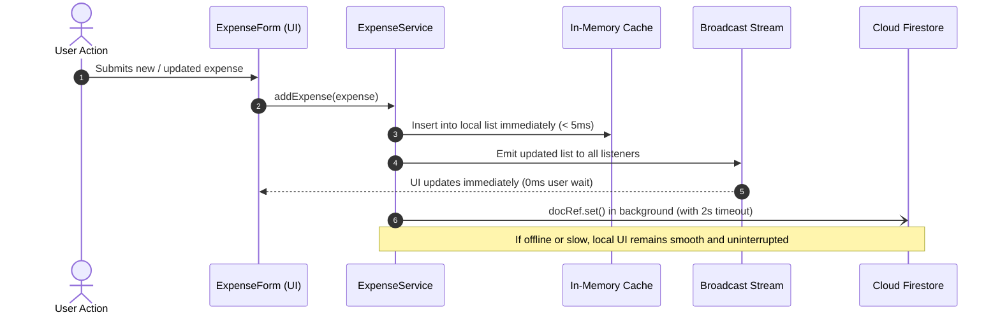

# 💳 Spendly — Modern Expense Tracker

[](https://flutter.dev)
[](https://dart.dev)
[](https://firebase.google.com)
[-success?logo=checkmarx&logoColor=white)](https://github.com)
[](LICENSE)

A clean, modern, and responsive personal expense tracker built with **Flutter** and **Firebase Cloud Firestore**. **Spendly** delivers an instant, offline-first user experience through optimistic in-memory caching and background cloud synchronization, paired with interactive visual analytics and deep dark-mode aesthetics.

Developed as a comprehensive practical demonstration for an internship software engineering task.

---

## 📱 Features

### 1. Complete Expense Management (CRUD)
- **Add Expenses:** Log title, amount, category, date, and optional notes with real-time field validation.
- **Edit & Update:** Tap any transaction or use the card menu to modify existing expense details.
- **Swipe-to-Delete:** Dismissible swipe gesture with intuitive red highlight and confirmation safety dialogs.
- **Optimistic UI Updates:** Instant (< 50ms) state updates locally before syncing to Firestore, ensuring zero user-facing lag.

### 2. Monthly Budgeting & Analytics
- **Month Navigation:** Easily navigate previous/next months or jump to any month using the interactive calendar picker.
- **Total Spent Highlight Card:** Dynamic gradient card showcasing month totals and transaction count with automatic currency scaling.
- **Interactive Donut Chart:** Built with `fl_chart`, featuring touch-activated slice expansions, center category breakdown, and an interactive legend.

### 3. Advanced Filtering & Live Search
- **Live Search:** Case-insensitive search across expense titles and notes with instant feedback.
- **Horizontal Category Chips:** Filter by 9 curated categories (*Food, Transport, Shopping, Bills, Entertainment, Health, Education, Travel, Other*).
- **Single-Date Filter:** Select specific calendar dates to inspect daily spending.
- **Clear Filters:** One-tap action to reset all active filters and restore the full history.

### 4. Dual Theme Support (Light & Dark Mode)
- **Deep Slate Dark Mode:** Custom-tailored dark palette (`#0F172A`) built for OLED displays with low visual fatigue.
- **Vibrant Light Mode:** Clean, high-contrast Material 3 theme with royal blue primary accents (`#2563EB`).
- **Reactive Toggle:** Smooth toggle button in the AppBar powered by a zero-overhead `ValueNotifier<ThemeMode>`.

### 5. Responsive Design & Accessibility
- **Screen Adaptability:** Fluid layout tested on narrow devices (320px width), standard phones, and tablets (up to 1024px+).
- **Tablet Optimization:** Content constrained to ergonomic reading widths (`maxWidth: 720px` for lists, `640px` for forms) and centered gracefully.
- **Overflow Prevention:** Every currency amount, title, and badge uses `Flexible`, `Expanded`, and `FittedBox` to prevent `RenderFlex` overflow even with large values (e.g., `Rs. 99,999,999.00`).
- **Friendly State Feedback:** Custom illustrations and action buttons for `LoadingState`, `EmptyState`, and `ErrorState`.

---

## 🏗 Architecture & Code Structure

Spendly follows a **clean, modular, interview-ready architecture** prioritizing simplicity, readability, and testability without unnecessary framework overhead (no BLoC, Cubit, or complex Clean Architecture layers).

```
lib/
├── main.dart                  # Application entrypoint & theme initialization
├── models/
│   └── expense.dart           # Expense entity, ExpenseCategory constants, & calculation extensions
├── services/
│   └── expense_service.dart   # Firestore CRUD, optimistic in-memory cache, & timeout handling
├── theme/
│   └── app_theme.dart         # Light & Dark color schemes, typography, and ThemeMode notifier
├── screens/
│   ├── home_screen.dart       # Primary dashboard with monthly summary, chart, and recent list
│   ├── expenses_screen.dart   # Full history with search, chips, and date filter
│   ├── add_expense_screen.dart# Screen wrapper for creating an expense
│   └── edit_expense_screen.dart# Screen wrapper for updating an expense
└── widgets/
    ├── expense_card.dart      # Transaction tile with category avatar, notes, amount, & menu
    ├── expense_form.dart      # Reusable form component with input validation & date picker
    ├── category_chart.dart    # Interactive fl_chart Donut chart with touch animations
    ├── empty_state.dart       # Reusable illustration for empty views & search results
    ├── error_state.dart       # Reusable error card with retry button
    └── loading_state.dart     # Centered loading spinner with custom label
```

### Why Simple State Management?
- **Predictable & Native:** Utilizes Flutter's built-in `setState`, `StreamBuilder`, and `ValueNotifier`.
- **Zero Boilerplate:** Business logic is transparent, easy to follow during code reviews, and requires no code generation (`build_runner`).
- **Dependency Injection:** Services and callbacks can be passed into widget constructors, enabling comprehensive mock testing.

---

## ⚡ Offline-First Optimistic Sync



---

## 🚀 Getting Started

### Prerequisites
- **Flutter SDK:** `>= 3.3.0` ([Install Flutter](https://docs.flutter.dev/get-started/install))
- **Dart SDK:** `>= 3.0.0`
- **Java Development Kit (JDK):** Version 17
- **Android Studio** or **VS Code** with Flutter extensions

### Installation & Run

1. **Clone the repository:**
   ```bash
   git clone https://github.com/Deneshkar/flutter-expense-tracker.git
   cd flutter-expense-tracker
   ```

2. **Install dependencies:**
   ```bash
   flutter pub get
   ```

3. **Verify analyzer status (Zero Warnings):**
   ```bash
   flutter analyze
   ```

4. **Run on an emulator or physical device:**
   ```bash
   flutter run
   ```

---

## 🔒 Firebase Configuration

1. Create a project in the [Firebase Console](https://console.firebase.google.com/).
2. Add an **Android App** with package name `com.cyphlab.spendly.spendly`.
3. Download `google-services.json` and place it in:
   ```
   android/app/google-services.json
   ```
4. Enable **Cloud Firestore** in test mode or production mode with the following rules:
   ```javascript
   rules_version = '2';
   service cloud.firestore {
     match /databases/{database}/documents {
       match /expenses/{document=**} {
         allow read, write: if true; // Configure auth rules for production
       }
     }
   }
   ```

---

## 🧪 Automated Testing Suite

Spendly features an exhaustive automated testing suite with **51 passing tests** covering unit logic, widget behavior, and responsiveness:

```bash
flutter test
```

### Test Suite Breakdown

| Test Suite | File | Tests | Description |
|---|---|---|---|
| **Form & Validations** | `test/add_expense_screen_test.dart` | 10 | Field validation, positive amounts, category select, submission |
| **Edit Expense** | `test/edit_expense_screen_test.dart` | 2 | Form pre-filling, data modification, and update callbacks |
| **Delete Expense** | `test/delete_expense_test.dart` | 5 | Confirmation dialog dismissal, approval, and swipe-to-delete |
| **History & Empty States** | `test/expenses_screen_test.dart` | 2 | List rendering, summary banner calculation, empty states |
| **Category & Date Filters**| `test/filtering_test.dart` | 9 | Category chips, date filtering, clear filters button |
| **Live Search** | `test/search_test.dart` | 8 | Title search, note search, case-insensitivity, empty results |
| **Monthly Calculations** | `test/monthly_calculation_test.dart` | 6 | Month navigation, spending aggregation, category breakdown |
| **Interactive Chart** | `test/category_chart_test.dart` | 3 | Donut chart rendering, touch feedback, legend display |
| **Theme Toggle** | `test/theme_test.dart` | 2 | Light/Dark theme switching via AppBar action button |
| **Responsiveness** | `test/responsiveness_test.dart` | 4 | 320x568 screen bounds, 800x1280 tablet scaling, large numbers |

---

## 📦 Building Production Release APK

To compile an optimized, standalone release APK for installation:

```bash
flutter build apk --release
```

The compiled APK will be located at:
```
build/app/outputs/flutter-apk/app-release.apk
```

---

## 💡 Key Technical Decisions (Interview Q&A)

<details>
<summary><b>1. Why use an in-memory optimistic cache instead of waiting for Firestore?</b></summary>
<br>
Calling <code>await firestore.collection().add()</code> blocks the UI thread if the network connection has high latency, is offline, or is experiencing cold-start handshakes. By applying optimistic local updates, the user experiences instantaneous UI feedback (< 50ms) while Firestore synchronizes in the background with a safety timeout.
</details>

<details>
<summary><b>2. How did you solve cross-device RenderFlex overflow issues?</b></summary>
<br>
All dynamic text and currency amounts are wrapped in <code>Flexible</code> or <code>Expanded</code> with explicit ellipsis truncation. Currency figures utilize <code>FittedBox(fit: BoxFit.scaleDown)</code> inside bounded constraints so amounts scale down proportionally rather than breaking the layout on narrow screens (e.g., 320px width).
</details>

<details>
<summary><b>3. How is tablet responsiveness handled without external packages?</b></summary>
<br>
Using Flutter's built-in <code>Align(alignment: Alignment.topCenter)</code> combined with <code>ConstrainedBox(constraints: BoxConstraints(maxWidth: 720))</code>. On mobile phones, widgets span full width; on tablets, content stays comfortably centered with optimal reading line-length.
</details>

<details>
<summary><b>4. How does Dark Mode persist and toggle without full app reloads?</b></summary>
<br>
<code>AppTheme.themeMode</code> is a global <code>ValueNotifier&lt;ThemeMode&gt;</code>. In <code>main.dart</code>, a <code>ValueListenableBuilder</code> listens to changes and re-renders only the <code>MaterialApp</code> theme without tearing down navigation stacks or destroying page state.
</details>

---

## 📄 License

This project is licensed under the MIT License — see the [LICENSE](LICENSE) file for details.
